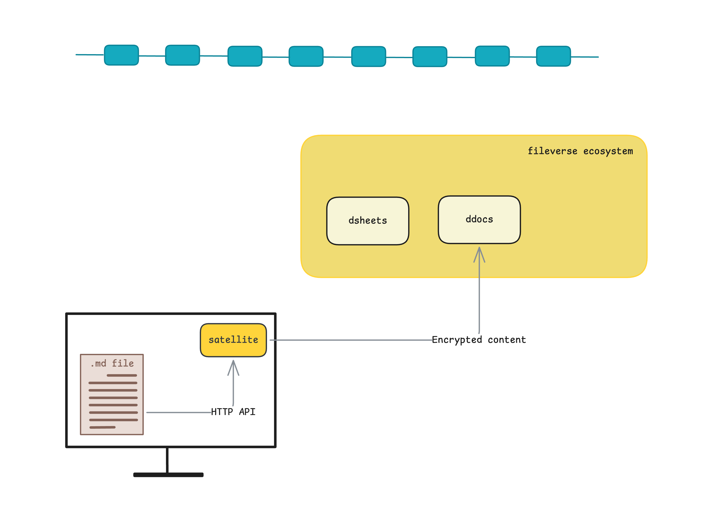

# Introduction to the satellite package

Welcome to the Satellite documentation. This page will give you a very brief idea of what satellite is and how it can support the way you work day to day. 

# Who is this for

The details can wait. What matters first is whether this is something you actually need. 
The easiest way to figure that out is through a few situations you might recognize.

- You love to write and have a habit of taking notes, putting down thoughts, errands, audacious yealy goals and what not, in simple text files on your computer. But you've always struggled when you had to choose the right platform to store these files persistently and securely. A platform that values your privacy — not by choice, but by design. 

- You were recently part of an incident-resolution huddle on slack where a lot of context and ideas was shared through a flurry of messages across multiple threads. Later it struck you that all those messages and insights will be lost unless an RCA is conducted and everything is documented. 

- You are reading a github issue raised on your favourite open-source library and the comments are a mixed bag of valueable investigations, findings, subjective opinions and tangents. And you just wish to extract the signal from the noise and document only what matters.

- Or maybe you’ve come across a thread on reddit with profound wisdom on life-advice — something you know you want to come back to, but you no longer trust your bookmarking strategy, because they’ve become a closet full of "equally valueble" advice you never revisit.

At its core, Satellite is for moments like these.

If you’ve ever come across text you found valuable, but fragile, easy to get lost, and hard to retrieve later — and you value privacy, then Satellite is for you.

# What is Satellite

Now that we’re aligned on the problem Satellite aims to solve, let’s look at what it is at a high level.

Once installed, Satellite runs as a background process on your computer. It runs an HTTP server that exposes a set of APIs you can use to create and manage ddocs. When you create a ddoc, satellite encrypts the content locally and publishes it on-chain. Once published, your documents become available in your [default API space] on Fileverse. You can view, edit, share and collaborate on them just like any other ddoc you have had.

You may think of it as an gateway or an elevator that ushers you into the Fileverse ecosystem where you have all your valueable text as persistent, secure documents.

# Welcome aboard

Head over to our [API Reference]() which has all the instructions to help you get started. 

